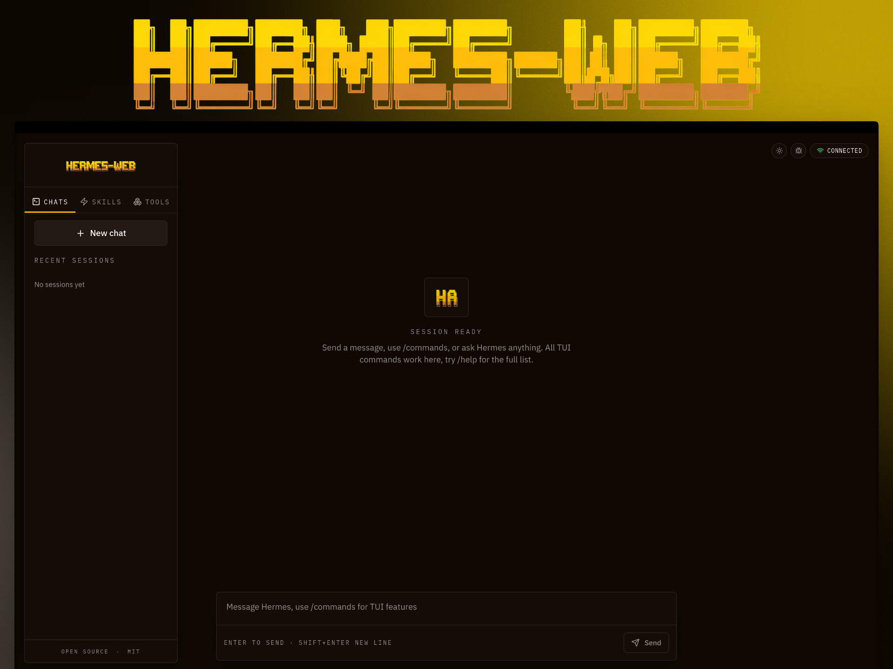

<p align="center">
  
</p>

<h1 align="center">Hermes-Web</h1>

<p align="center">
  A browser UI for <a href="https://github.com/NousResearch/hermes-agent">Hermes Agent</a>.
</p>

<p align="center">
  
  
  
  
</p>

---

## Overview

Hermes-Web connects to the Hermes Agent TUI gateway over WebSocket. You get a browser chat surface on top of the agent without modifying the agent runtime itself.

## Install

### Linux, macOS, WSL, Termux

```bash
git clone git@github.com:ChloeVPin/hermes-web.git
cd hermes-web
bash scripts/install.sh
```

### Windows (PowerShell)

```powershell
git clone git@github.com:ChloeVPin/hermes-web.git
cd hermes-web
.\scripts\install.ps1
```

The installer scripts in this repo handle both local checkout and direct setup.

The installer handles the following:

- Detects OS, architecture, and package manager
- Installs prerequisites including Git and Node.js 18+
- Clones or updates `hermes-agent` if needed
- Builds the frontend and the bridge
- Creates the `hermes-web` command and launcher scripts

## Prerequisites

| Requirement | Version | Notes |
|---|---|---|
| Node.js | 18+ | With npm |
| Python | 3.10+ | Required for the Python bridge fallback |
| Hermes Agent | latest | Cloned adjacent to this repo |
| API key | any supported provider | Configured inside `hermes-agent` |

## Configure Hermes Agent

Configure `hermes-agent` with an API key on the machine hosting the agent:

```bash
cd ~/hermes-agent  # or your hermes-agent directory

# Option 1: use the hermes CLI
hermes model

# Option 2: set an API key via environment variable
export OPENROUTER_API_KEY="your-api-key"
# or
export OPENAI_API_KEY="your-api-key"
# or
export ANTHROPIC_API_KEY="your-api-key"

# Save to ~/.hermes/.env for persistence
mkdir -p ~/.hermes
echo "OPENROUTER_API_KEY=your-api-key" >> ~/.hermes/.env
```

For more configuration detail, see the [Hermes Agent repository](https://github.com/NousResearch/hermes-agent).

## Features

<table>
<tr>
<td width="50%" valign="top">

**Chat surface**
- Streaming messages with deltas
- Thinking and reasoning display
- Interactive approval, clarify, sudo, and secret prompts
- Tool activity and subagent tracking

</td>
<td width="50%" valign="top">

**Workspace**
- Sidebar tabs for chats, skills, and toolsets
- Session management: create, resume, delete, branch, undo, compress
- Slash commands from the live gateway catalog
- Built-in commands: `/help`, `/model`, `/tools`, and more

</td>
</tr>
<tr>
<td width="50%" valign="top">

**Interface**
- Dark and light theme toggle
- Connection status indicator
- Debug panel for logs and errors

</td>
<td width="50%" valign="top">

**Transport**
- Rust bridge (default when built)
- Python bridge (fallback)
- JSON-RPC over WebSocket

</td>
</tr>
</table>

## Architecture

```text
┌─────────────────┐         ┌─────────────────┐         ┌─────────────────┐
│                 │         │                 │         │                 │
│  Browser (React)│ ◄─────► │     Bridge      │ ◄─────► │   tui_gateway   │
│                 │   WS    │  (Rust or Py)   │ stdio   │  (JSON-RPC)     │
│                 │         │                 │         │                 │
└─────────────────┘         └─────────────────┘         └─────────────────┘
```

The bridge spawns the `hermes-agent` `tui_gateway` subprocess and passes JSON-RPC messages over WebSocket.

## Quick Start

```bash
# 1. Install frontend dependencies
npm install

# 2. Start the Python bridge
pip install websockets
HERMES_AGENT_DIR=../hermes-agent python bridge/server.py

# 3. Start the frontend
npm run dev
```

After install, the combined launcher is also available:

```bash
bash start.sh
```

Open `http://localhost:5173`.

## Environment Variables

| Variable | Default | Description |
|---|---|---|
| `HERMES_AGENT_DIR` | `../hermes-agent` | Path to the `hermes-agent` checkout |
| `BRIDGE_HOST` | `0.0.0.0` | Bridge bind host |
| `BRIDGE_PORT` | `9120` | Bridge bind port |
| `HERMES_PYTHON` | auto-detect | Python used for the gateway subprocess |

## Project Structure

```text
src/
├── lib/
│   ├── gateway-types.ts           # TypeScript types for the JSON-RPC protocol
│   ├── gateway-client.ts          # WebSocket JSON-RPC client
│   └── use-gateway.ts             # React hook for sessions, chat, tools, commands
├── components/hermes/
│   ├── hermes-web-app.tsx         # Main app shell
│   ├── hermes-web.tsx             # Chat messages and empty state
│   ├── hermes-sidebar.tsx         # Tabs for chats, skills, and tools
│   ├── hermes-prompt-composer.tsx # Input and slash menu
│   └── hermes-slash-menu.tsx      # Slash command autocomplete
bridge/
├── server.py                      # Python WebSocket bridge
scripts/
├── get.sh                         # Bootstrap helper
├── install.sh                     # Installer for Linux, macOS, WSL, Termux
└── install.ps1                    # Installer for Windows PowerShell
```

## Build

```bash
npm run build
```

## Uninstall

```bash
rm -rf ~/hermes-web
rm /usr/local/bin/hermes-web
rm ~/.local/share/applications/hermes-web.desktop
```

## Reinstall

```bash
rm -rf ~/hermes-web
git clone git@github.com:ChloeVPin/hermes-web.git ~/hermes-web
cd ~/hermes-web
bash scripts/install.sh
```

## Links

- [Release v1.0.0](./RELEASES/v1.0.0.md)
- [Changelog](./CHANGELOG.md)
- [Contributing](./CONTRIBUTING.md)
- [Security Policy](./SECURITY.md)
- [Troubleshooting](./TROUBLESHOOTING.md)
- [Performance Notes](./PERFORMANCE.md)
- [Acknowledgments](./ACKNOWLEDGMENTS.md)

---

<p align="center">
  <sub>MIT licensed. Built on <a href="https://github.com/NousResearch/hermes-agent">Hermes Agent</a> by <a href="https://nousresearch.com">Nous Research</a>.</sub>
</p>
